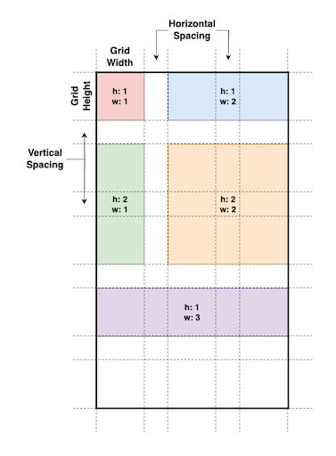
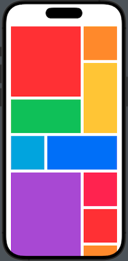
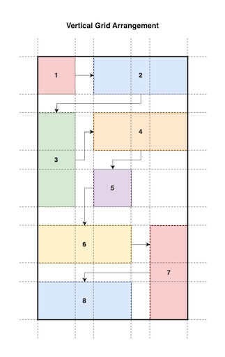
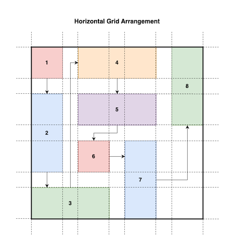

# MosaicGrid

`MosaicGrid` is a SwiftUI library that provides both horizontal and vertical mosaic grid views, along with utility functions for customizing view tile sizes and placement. These components allow you to arrange multiple items in a visually appealing grid layout.

[](https://app.codacy.com/gh/hainayanda/MosaicGrid/dashboard?utm_source=gh&utm_medium=referral&utm_content=&utm_campaign=Badge_grade)


[](https://swift.org/package-manager/)
[](https://cocoapods.org/pods/MosaicGrid)
[](https://cocoapods.org/pods/MosaicGrid)
[](https://cocoapods.org/pods/MosaicGrid)

## Example

To run the example project, clone the repo, and run `pod install` from the Example directory first.

## Requirements

- Swift 5.5 or higher
- iOS 16.0 or higher
- MacOS 13.0 or higher
- TVOS 16.0 or higher
- WatchOS 8.0 or higher
- Xcode 14 or higher

## Installation

### CocoaPods

You can easily install MosaicGrid via [CocoaPods](https://cocoapods.org). Add the following line to your Podfile:

```ruby
pod 'MosaicGrid', '~> 1.0'
```

### Swift Package Manager (Xcode)

To install using Xcode's Swift Package Manager, follow these steps:

- Go to **File > Swift Package > Add Package Dependency**
- Enter the URL: **<https://github.com/hainayanda/MosaicGrid.git>**
- Choose **Up to Next Major** for the version rule and set the version to **1.0.0**.
- Click "Next" and wait for the package to be fetched.

### Swift Package Manager (Package.swift)

If you prefer using Package.swift, add MosaicGrid as a dependency in your **Package.swift** file:

```swift
dependencies: [
    .package(url: "https://github.com/hainayanda/MosaicGrid.git", .upToNextMajor(from: "1.0.0"))
]
```

Then, include it in your target:

```swift
 .target(
    name: "MyModule",
    dependencies: ["MosaicGrid"]
)
```

## Usage

### Mosaic Grid Arrangement

`MosaicGrid` is similar to `UICollectionView`, but with much more flexibility. `MosaicGrid` will divide the view into grids (with spacing if have any) and allow you to utilize it for view placement.



How the placement will go will depend on the type of MosaicGrid you use, whether is it `VMosaicGrid` or `HMosaicGrid`. You can utilize `tileSized(w:h:)` to control how many tiles will be used for each view. With this, arranging UI with grid placement will be very easy!

 Like this photo album example:


Or this abstract-like art :stuck_out_tongue_winking_eye:


### VMosaicGrid



`VMosaicGrid` is a vertical mosaic grid view. It will try to fill the horizontal grids then continue down and make the view grow to the bottom.

```swift
VMosaicGrid(hGridCount: 3, spacing: 2) {
    ForEach(models) { model in
        MyView(from: model)
            .tileSize(w: model.width, h: model.height)
    }
}
```

The arrangement will be following this pattern:



You can customize how the grid size is calculated by using these 3 different `init`:

```swift
/// Initialize Vertical Mosaic Grid View.
/// It will divide the width of the view with `hGridCount` to get the height of a single grid.
/// If `spacing` is provided, it will add it to the calculation to make sure each grid has a spacing from each other.
/// `gridAspectRatio` then will be used to calculate the height of a single grid.
/// `content` will be used to get the view to be arranged by the Mosaic Grid View
/// - Parameters:
///   - hGridCount: Count of the horizontal grid.
///   - spacing: Spacing on each grid. The default is zero.
///   - gridAspectRatio: Aspect ratio of each grid
///   - content: View that will be used as this Mosaic Grid Content
public init(hGridCount: Int, spacing: MosaicGridSpacing = .zero, gridAspectRatio: Double = 1, @ViewBuilder content: @escaping () -> Content) { ... }
```

```swift
 /// Initialize Vertical Mosaic Grid View.
 /// It will divide the width of the view with `hGridCount` to get the height of a single grid.
 /// If `spacing` is provided, it will add it to the calculation to make sure each grid has a spacing from each other.
 /// `gridHeight` then will be used as the height of a single grid.
 /// `content` will be used to get the view to be arranged by the Mosaic Grid View
 /// - Parameters:
 ///   - hGridCount: Count of the horizontal grid.
 ///   - spacing: Spacing on each grid. The default is zero.
 ///   - gridHeight: Width of each grid
 ///   - content: View that will be used as this Mosaic Grid Content
public init(hGridCount: Int, spacing: MosaicGridSpacing = .zero, gridHeight: CGFloat, @ViewBuilder content: @escaping () -> Content) { ... }
```

```swift
 /// Initialize Vertical Mosaic Grid View.
 /// It will use `gridSize` as the size of a single grid
 /// If `minimumSpacing` is provided, it will add it to the calculation to make sure each grid has a minimum spacing from each other.
 /// `content` will be used to get the view to be arranged by the Mosaic Grid View
 /// - Parameters:
 ///   - gridSize: Static size of a single grid.
 ///   - minimumSpacing: Minimum spacing on each grid. The default is zero.
 ///   - content: the view that will be used as this Mosaic Grid Content
public init(gridSize: CGSize, minimumSpacing: MosaicGridSpacing = .zero, @ViewBuilder content: @escaping () -> Content) { ... }
```

### HMosaicGrid


`HMosaicGrid` is a horizontal mosaic grid view. It will try to fill the vertical grids then continue right and make the view grow to the right.

```swift
HMosaicGrid(vGridCount: 3, spacing: 2) {
    ForEach(models) { model in
        MyView(from: model)
            .tileSize(w: model.width, h: model.height)
    }
}
```

The arrangement will be following this pattern:



You can customize how the grid size is calculated by using these 3 different `init`:

```swift
 /// Initialize Horizontal Mosaic Grid View.
 /// It will divide the height of the view with `vGridCount` to get the height of a single grid.
 /// If `spacing` is provided, it will add it to the calculation to make sure each grid has a spacing from each other.
 /// `gridAspectRatio` then will be used to calculate the width of a single grid.
 /// `content` will be used to get the view to be arranged by the Mosaic Grid View
 /// - Parameters:
 ///   - vGridCount: Count of the vertical grid.
 ///   - spacing: Spacing on each grid. The default is zero.
 ///   - gridAspectRatio: Aspect ratio of each grid
 ///   - content: View that will be used as this Mosaic Grid Content
 public init(vGridCount: Int, spacing: MosaicGridSpacing = .zero, gridAspectRatio: Double = 1, @ViewBuilder content: @escaping () -> Content) { ... }
```

```swift
 /// Initialize Horizontal Mosaic Grid View.
 /// It will divide the height of the view with `vGridCount` to get the height of a single grid.
 /// If `spacing` is provided, it will add it to the calculation to make sure each grid has a spacing from each other.
 /// `gridWidth` then will be used as the height of a single grid.
 /// `content` will be used to get the view to be arranged by the Mosaic Grid View
 /// - Parameters:
 ///   - vGridCount: Count of the vertical grid.
 ///   - spacing: Spacing on each grid. The default is zero.
 ///   - gridWidth: Width of each grid
 ///   - content: View that will be used as this Mosaic Grid Content
 public init(vGridCount: Int, spacing: MosaicGridSpacing = .zero, gridWidth: CGFloat, @ViewBuilder content: @escaping () -> Content) { ... }
```

```swift
 /// Initialize Horizontal Mosaic Grid View.
 /// It will use `gridSize` as the size of a single grid
 /// If `minimumSpacing` is provided, it will add it to the calculation to make sure each grid has a minimum spacing from each other.
 /// `content` will be used to get the view to be arranged by the Mosaic Grid View
 /// - Parameters:
 ///   - gridSize: Static size of a single grid.
 ///   - minimumSpacing: Minimum spacing on each grid. The default is zero.
 ///   - content: the view that will be used as this Mosaic Grid Content
 public init(gridSize: CGSize, minimumSpacing: MosaicGridSpacing = .zero, @ViewBuilder content: @escaping () -> Content) { ... }
```

### SpacerTile

`SpacerTile` is a utility function to create a clear rectangle with a given tile size. It is used if you want to make sure some grids are not occupied with a view.

```swift
VMosaicGrid(hGridCount: 3, spacing: 2) {
    ForEach(models) { model in
        MyView(from: model)
            .tileSize(w: model.width, h: model.height)
        // spacer that fills grid 3x1
        SpacerTile(w: 3, h: 1)
    }
}
```

### MosaicGridSpacing

`MosaicGridSpacing` is a struct representing horizontal and vertical spacing for Mosaic Grid. It's an object passed when creating MosaicGrid to represent spacing. Normally we can just use Double literal since this struct implements ExpressibleByFloatLiteral and ExpressibleByIntegerLiteral.

```swift
// Using Integer literal
VMosaicGrid(hGridCount: 3, spacing: 2) { ... }
```

```swift
// Using Double literal
VMosaicGrid(hGridCount: 3, spacing: 2.0) { ... }
```

```swift
// Using MosaicGridSpacing. h is horizontal spacing, v is vertical spacing
VMosaicGrid(hGridCount: 3, spacing: .init(h: 2, v: 2)) { ... }
```

## Contributing

Contributions are welcome! Please follow the guidelines in the [CONTRIBUTING.md](CONTRIBUTING.md) file.

## License

MosaicGrid is available under the MIT license. See the [LICENSE](LICENSE) file for more info.

## Credits

This project is maintained by [Nayanda Haberty](hainayanda@outlook.com).
